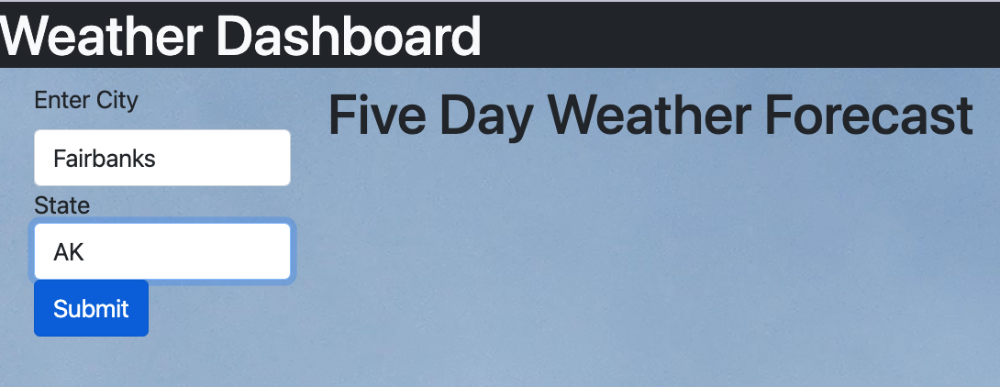

# met

# 06 Server-Side APIs: Weather Dashboard

This is a 5 Day Weather Forecast  Click here to try it out!
https://bcebel.github.io/met/

It will give you today's weather at the top of the screen, followed by a 5 day forecast below.  
It is based on city and state in the US.  It will turn the town and state request into local coordinates.

 

Challenges were navigating objects and DOM manipulation!  

## License 
MIT License, see repository for details. 

